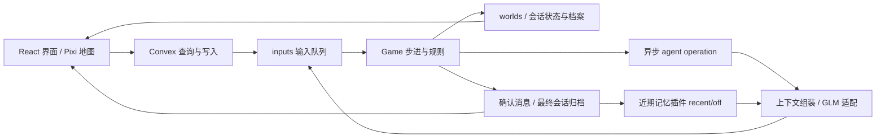

# 当前架构

本文描述现有运行机制。近期原句记忆与消息确认已接入；Jev、多人记忆体验和学习控制器仍在 [路线图](roadmap.md)。

## 运行链路

人类输入通过 [useSendInput](../src/hooks/sendInput.ts)等待引擎返回成功或失败；消息文本经 [messages](../convex/messages.ts)与 [messageSubmission](../convex/aiTown/messageSubmission.ts)查重并排入输入，未确认文本不进入 messages。输入结果、有效消息与世界状态在 saveWorld 的同一 Convex 事务提交。订阅将状态变化送到前端，Pixi 根据位置历史插值渲染。

[Game](../convex/aiTown/game.ts)处理输入，推进人物、寻路、位置、会话与 NPC，然后保存差异。外部模型请求由 [agentOperations](../convex/aiTown/agentOperations.ts)执行，不能阻塞 tick。引擎步进及 generation 协调在 [main](../convex/aiTown/main.ts)与 [engine](../convex/engine/abstractGame.ts)。

[Agent](../convex/aiTown/agent.ts)已有单个进行中 operation、超时、活动与邀请调度；背景行为目前以规则和随机活动为主，未由 Jev 决定。另一位 NPC 可按现有概率规则接受或拒绝 NPC 邀请；对人类邀请当前直接接受。

模型连接失败（包括 fetch 的 TLS/connect TypeError）复用有限退避；每次聊天的请求共用 90 秒网络预算。生成失败通过 agentMessageFailed 内部输入核对 operation / 会话 / UUID，立即释放等待，保存可选 replyError 到活动会话；引擎 120 秒兜底也展示超时。失败不作为 NPC 发言或记忆。前端可提交 retryReply 重新生成，或发送新消息清除错误；旧失败与旧回复不能改变新操作。已有会话缺少该字段时按无错误读取。

## 责任与事实来源

| 层 | 责任 | 主要入口 |
| --- | --- | --- |
| 前端 | 选人、输入、可见会话状态、地图控制和订阅清理 | [Game](../src/components/Game.tsx)、[PlayerDetails](../src/components/PlayerDetails.tsx)、[MessageInput](../src/components/MessageInput.tsx) |
| 世界规则 | 路径、碰撞、会话成员、距离、输入是否合法 | [movement](../convex/aiTown/movement.ts)、[conversation](../convex/aiTown/conversation.ts)、[inputs](../convex/aiTown/inputs.ts) |
| NPC 生命周期 | 活动选择、邀请、发言时机、异步 operation | [agent](../convex/aiTown/agent.ts)、[agentInputs](../convex/aiTown/agentInputs.ts) |
| 语言与记忆 | 人设、当前已确认原句、本人近期证据与 recent/off 策略 | [conversation](../convex/agent/conversation.ts)、[conversationMemory](../convex/agent/conversationMemory.ts)；旧向量 [memory](../convex/agent/memory.ts) |
| 供应商适配 | 模型与网关、请求限制、响应解析、超时和重试 | [llm](../convex/util/llm.ts) |
| 持久化与初始化 | 表、索引、档案、世界创建与初始人物 | [schema](../convex/schema.ts)、[init](../convex/init.ts) |

位置、邀请与动作结果以程序状态为准。模型语言表达、个人看法和未兑现的计划不能写成世界事实。更换供应商应留在适配层，增加行为先扩展已有 operation / 输入处理器，不为每个功能新增通用事件总线。

## 持久化数据

| 数据 | 现有内容与边界 |
| --- | --- |
| `worlds` / `maps` / `worldStatus` | 当前人物、活动、会话、地图和世界运行状态 |
| `engines` / `inputs` | 步进进度、generation、排队操作及返回结果；不是完整模型请求日志 |
| `playerDescriptions` / `agentDescriptions` | 已保存人物名字、人设和计划；源文件修改不自动迁移 |
| `messages` | 已确认原句、作者、UUID、世界、sentAt、confirmationVersion；旧记录保留展示，模型过滤旧记录 |
| `archivedConversations` / `participatedTogether` | 已结束会话、参与者、时间以及双方经历关系 |
| `memories` / `memoryEmbeddings` | 上游语义记忆与向量；当前开关关闭时不检索、不总结、不反思 |

具体契约在 [世界表](../convex/aiTown/schema.ts)、[引擎表](../convex/engine/schema.ts)、[记忆表](../convex/agent/schema.ts)。模型开场和继续回复都会调用 conversationMemory.recall。recordConversation 复用 archivedConversations 与 participatedTogether，不复制聊天、不新增记忆表。recent 策略按世界/本人查询最近 10 段候选，核对参与者和确认版本，优先当前对象，最多提供 3 段 / 每段 20 条 / 4,000 字符。off 不供给历史但照常归档；查询失败与无记录区分。证据以独立、不可信 JSON 数据传入模型，保留作者、时间、消息 UUID、会话和截断标记。

每个 AgentDescription 的可选 memoryMode 默认 recent；setMemoryMode 走引擎输入，改变设置时使进行中的回复失效。前端展示同一检索来源和开关。向量开关不影响近期查询，旧向量实现仍保留但当前对话不调用它。

[crons](../convex/crons.ts)定时清理超过保留期的已完成输入、记忆和向量（未完成输入保留）；消息清理当前未启用。因此不能声称仅凭现有输入表能永久回放完整世界，未来回放需要保留初始快照、事件与外部结果。

## 生命周期与当前限制

- 会话是双人结构，每人同时一段；邀请、走近、参与与离开由状态机维护。当前不是群聊或人类加入已有双人聊天。
- 玩家与 NPC 发言只通过查重提交入口排队；引擎核对正式成员、NPC operation 名称/ID/会话/UUID/截止时间后接受。公共世界输入不接受消息完成与 NPC 回调，main.sendInput 是 internalMutation。离开会取消旧操作；NPC 回答后等待人类接话。身份仍是匿名本机模式，并非已实现用户授权。
- 聊天候选距离使用对象的实际坐标；NPC 多人自主交流仍需单独体验验收。
- 后台活动、邀请冷却、路径超时、会话消息数与最长持续时间受 [constants](../convex/constants.ts)限制。文本自由不代表会话无限持续。
- 人类成功操作刷新 `lastInput`，闲置五分钟退出；浏览器 [heartbeat](../src/hooks/useWorldHeartbeat.ts)维持世界被查看状态，不应被用来刷新用户活动。
- 模型调用未记录完整输入、候选决策和所有失败结果；当前没有离线端到端回放工具，测试约定见 [测试指南](testing.md)。

## 扩展时必须维护的边界

新异步结果在任何持久化或动作提交前检查 operation、会话、成员和世界，处理重复、超时、用户离开与引擎重启。提交失败要有明确结果，不能靠台词掩盖。数据格式变更说明旧记录兼容或迁移，保留回退办法。

未来非对话事件扩展记忆来源；Jev 只从程序生成的合法候选中选完整动作 ID，执行前再次检查；英语评价保存原句证据，独立于世界事实。各模块的计划、验收与依赖见 [路线图](roadmap.md)。

## 归档与兼容

Conversation.stop 捕获结束当时的快照，包含最终消息数与模拟结束时间；GameStateDiff 只携带本步 acceptedMessages / endedConversations，不把全文加入 worlds。saveWorld 原子保存输入结果、状态、消息、会话归档与参与关系。旧消息与档案缺少 confirmationVersion，保留展示但不自动进入可信回忆。新索引和字段均兼容旧数据；不清库、不重新初始化世界。提交键索引由事务查重，并不是数据库唯一约束。
